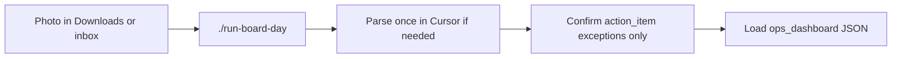

# Board Daily Workflow (Lean Standard Work)

**CTQ:** physical board → trusted action items toward the ops dashboard, every shift.

Extraction rules stay in `python-whiteboard-parser`. Image gates stay in `image-ingest-hardening`. Issue/dashboard shape stays in `board-action-exporter`. Mermaid, stitcher, sticky-parse, change-tracker, eval, and FastAPI jobs are **pull tools** — not daily takt.

## Standard work (2–3 human touches)



1. Land a **full-res** photo in `~/Downloads` or `fixtures/boards/inbox/` (USB / Quick Share / Photos Download — never chat attach).
2. From the project root run **one command**:

```bash
./run-board-day
# or: ./run-board-day --from-inbox
# or: ./run-board-day ~/Downloads/PHOTO.jpg
```

3. If exit `3`, paste the printed Madlibs prompt into Cursor (`Parse the whiteboard photo at @…`), then:

```bash
./run-board-day --skip-ingest
```

4. If exit `1`, `review.md` opens automatically — **action-item exceptions only**. Fix or clear `needs_review` in `parsed_board.json` for verified rows.
5. Pull **clear** rows into the Calendar/Ops dashboard (idempotent on `idempotency_key`):

```bash
./run-board-day --skip-ingest --pull-dashboard
# Dashboard must be running, default http://127.0.0.1:8000
# Override: BOARD_DASHBOARD_URL=http://127.0.0.1:8000 BOARD_DASHBOARD_FLOOR=1F
```

Clear items can pull even while exceptions remain; flagged rows stay out until verified.

Optional sample-before-bulk: `./run-board-day --skip-ingest --sample-limit 3`.

## What the one command does

| Stage | Behavior |
|---|---|
| Ingest + harden | Copies camera original, rejects previews (`ingest-board` / validate) |
| Parse gate | Exit `3` if `parsed_board.json` missing or source hash ≠ ingested image |
| Exception review | `review_queue.py --kind action_item` → `out/day/review.md` |
| Export | Dry-run clear items only → `out/day/export/` (skips `needs_review`) |
| Dashboard pull | Optional `--pull-dashboard` → `POST /api/directions` with `external_id` |
| Summary | `out/day/DAY.md` operator checklist; opens `review.md` on exceptions |

Exit codes: `0` clear, `1` exceptions remain, `2` hard fail, `3` parse required.

## AI input patterns

| Step | Pattern |
|---|---|
| Ingest → parse prompt | **Madlibs** (filled by the command / ingest) |
| Parse | **Open Input** scoped to `@path` only |
| Review | **Verification** on action items (not the whole board) |
| Export | **Auto-fill** dry-run; use `--sample-limit` before trusting bulk |

## Rules

- Do not invent text to clear `needs_review`.
- Do not run Mermaid / stitcher / eval as part of daily takt unless pulled.
- Do not duplicate ingest — `./run-board-day` calls existing scripts.
- Full suite remains the toolbox; this skill is the **operating path**.
